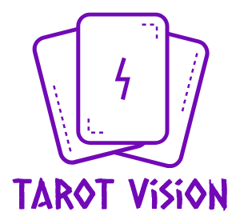

<h1 align="center">
    
</h1>
Aplicação para retirada do tarot diário.

Acesse o site aqui: https://brunafranciele.github.io/tarot-vision/

### `Ferramentas`
A parte front-end do projeto foi construída em React com componentes funcionais e usamos Context API e Hooks para gerenciamento do estado.

### `Instalação do Projeto:`
```
npm install
npm install --save react-router-dom
```
### `Iniciar o Servidor:`
```
npm start
```
### `P.S.:`
Esse projeto foi desenvolvido de forma responsiva, rodando em desktop e mobile.
